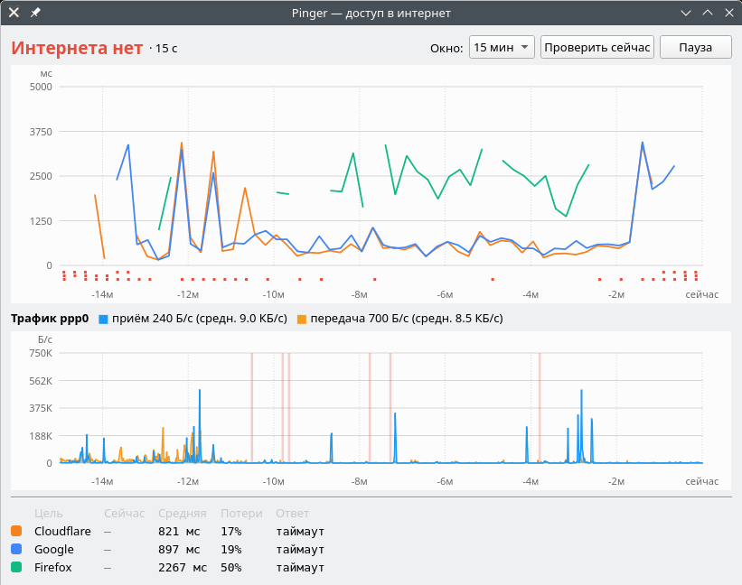

# Pinger

Значок в системном трее, который отвечает на один вопрос: **есть сейчас интернет или нет?**

<p>
  
  &nbsp;
  
</p>

## Зачем

В регионе с интернетом постоянные проблемы: то он есть, то его нет, а чаще «вроде есть» —
что-то грузится, мессенджер жив, а сайты не открываются. Каждый раз лезть в окна статистики
сетевых соединений, запускать `ping` в терминале и гадать по цифрам — лень. Хочется одним
взглядом на трей понять: работает, тормозит, висит или умерло.

Pinger для этого и нужен: он постоянно проверяет доступность нескольких узлов, рисует в иконке
трея задержки и трафик, а по клику открывает окно с графиками за последние минуты.

### Почему не обычный ping

Первая версия ([pinger_icmp_old.py](pinger_icmp_old.py)) пинговала `8.8.8.8` и оказалась бесполезной.
Прокси с TUN-интерфейсом (Happ, sing-box, xray и т. п.) отвечают на ICMP **собственным сетевым
стеком**, не выпуская пакет наружу, — `ping` показывает стабильные 0.1 мс при полностью мёртвом
интернете. Проверить у себя: если `ip route get 8.8.8.8` уходит через `tun0`, ping ничего не меряет.

Поэтому Pinger делает настоящие HTTP-запросы и **проверяет содержимое ответа**: так видно не только
обрыв связи, но и captive portal («авторизуйтесь в Wi-Fi»), и подмену DNS — там соединение
устанавливается, но ответ чужой.

### Почему рядом трафик

Задержка сама по себе может врать в обе стороны:

- **Канал забит загрузкой.** Если что-то активно качается, очереди в модеме и на базовой станции
  растут, проверочные запросы стоят в хвосте и отваливаются по таймауту — Pinger говорит
  «интернета нет», хотя данные идут.
- **Сеть действительно умерла.** Тогда из интерфейса что-то уходит (повторные попытки
  соединений), а **входящий трафик строго на нуле**. Это самый надёжный признак: исходящий
  может быть, а входящий на нуле — интернет мёртв.

Поэтому Pinger считает трафик прямо на WAN-интерфейсе (у модема это обычно `ppp0` или `wwan0`),
в обход туннеля прокси, и подсвечивает красным периоды «передача есть, приём ноль».

На скриншоте выше как раз такой спорный момент: проверки не проходят уже 15 секунд
(«Интернета нет»), но входящий трафик понемногу идёт, а незадолго до этого были всплески
по сотне-другой КБ/с. То ли сеть в полуобморочном состоянии и что-то ещё пролезает, то ли
вот-вот окончательно ляжет — график трафика помогает отличить одно от другого.

На мобильной связи бывают и совсем странные вещи: ответ приходит через 50–80 **секунд**. Пакет всё это
время лежит в очередях радиоканала, который не выбрасывает данные, а перепосылает их, пока не пройдут.
Приложения с терпеливыми таймаутами в такие моменты продолжают работать, остальные — нет. Pinger
ждёт ответа до минуты и честно записывает такие задержки, а пока ждёт — показывает состояние «висит».

## Что показывает

### Иконка в трее

Сверху вниз:

| Зона | Что значит |
|---|---|
| **Трафик** (большая часть иконки) | Приём — синий, передача — оранжевая, столбик на каждые 2 секунды. Масштаб — от средней скорости за видимый период: видно, что «хоть что-то качается», даже если это сотня байт. Пустая полоса — трафика нет вообще. Красный столбик — передача есть, а приём строго нулевой: пакеты уходят, ответов нет |
| **Точки задержки** | Одна точка на проверку: зелёная — до 300 мс, жёлтая — до 2 с, оранжевая — дольше. Красная — ответа нет, фиолетовая — запрос висит |
| **Полоса статуса** | Общий вердикт по всем узлам (см. ниже) |

Подсказка при наведении мыши — текущий статус, ответ каждого узла и скорость трафика.
Всплывающих уведомлений нет намеренно: всё сообщает сама иконка.

### Статусы

| Цвет | Статус | Когда |
|---|---|---|
| 🟢 | Интернет работает | все узлы ответили правильно |
| 🟡 | Связь частичная | часть узлов отвечает, часть нет |
| 🟠 | Ответ подменён | соединение есть, но содержимое чужое: captive portal, подмена DNS, неожиданный редирект |
| 🟣 | Связь висит | запросы ушли, ответа нет дольше 10 с, но и таймаута ещё нет |
| 🔴 | Интернета нет | ни один узел не ответил |

### Окно статистики

Открывается кликом по иконке. Сверху — задержки по каждому узлу, под осью — отметки сбоев
(своя строчка на каждый узел). Если запрос висит, от момента отправки растёт пунктир «ждём N с».
Ниже — график трафика WAN с текущей и средней скоростью. Внизу — таблица узлов: последний ответ,
средняя задержка и процент потерь за время наблюдения. Окно можно переключать от 2 минут до часа.

## Запуск

Нужны Python 3 и системный PyQt5 (с модулем QtNetwork):

```bash
sudo apt install python3-pyqt5
```

```bash
python3 pinger.py
```

Флаг `--window` сразу открывает окно статистики. Если системного трея нет, окно открывается само.
Закрытие окна только прячет его — приложение продолжает жить в трее, выход через меню иконки.

### Автозапуск

Создайте `~/.config/autostart/pinger.desktop` (путь к `pinger.py` поправьте на свой):

```ini
[Desktop Entry]
Type=Application
Name=Pinger
Comment=Индикатор доступа в интернет
Exec=python3 /home/user/Projects/Pinger/pinger.py
X-GNOME-Autostart-enabled=true
```

## Настройка

При первом запуске создаётся `~/.config/pinger/config.json` (учитывается `XDG_CONFIG_HOME`):

| Ключ | По умолчанию | Смысл |
|---|---|---|
| `interval_ms` | `5000` | Период проверок |
| `timeout_ms` | `60000` | Сколько ждать ответа. Большой намеренно: поздний ответ — ценный замер, а не сбой |
| `hang_ms` | `10000` | Через сколько запрос без ответа считается «висящим» |
| `history` | `1200` | Сколько замеров помнить по каждому узлу |
| `wan_interface` | `""` | Интерфейс для графика трафика. Пусто — берётся из маршрута по умолчанию |
| `targets` | см. ниже | Проверяемые узлы |

Отсутствующие ключи берутся из значений по умолчанию, но список `targets` заменяется целиком.

По умолчанию проверяются служебные адреса для обнаружения captive portal — Cloudflare
(`cdn-cgi/trace`), Google (`generate_204`) и Firefox (`success.txt`): они крошечные, не требуют
авторизации и отвечают заранее известным содержимым, что и позволяет проверить ответ.
Свой узел должен обладать тем же свойством.

Узлы бывают двух видов:

```json
{
  "targets": [
    {
      "name": "Cloudflare",
      "url": "https://cloudflare.com/cdn-cgi/trace",
      "expect_status": 200,
      "expect_body": "fl=",
      "color": "#f6821f"
    },
    {
      "name": "Роутер",
      "type": "tcp",
      "host": "192.168.1.1",
      "port": 80,
      "color": "#9b59b6"
    }
  ]
}
```

- **HTTP** — ответ считается правильным, только если совпали и код (`expect_status`), и кусок
  содержимого (`expect_body`). Редиректы не выполняются: перенаправление на страницу входа —
  как раз признак captive portal.
- **TCP** — просто проверка, что порт открыт. Удобно для роутера: отличает «локальная сеть жива,
  интернет — нет» от «отвалилось вообще всё».

## Файлы

- [pinger.py](pinger.py) — всё приложение, один файл.
- [pinger_icmp_old.py](pinger_icmp_old.py) — первая версия на ICMP, оставлена для истории.
